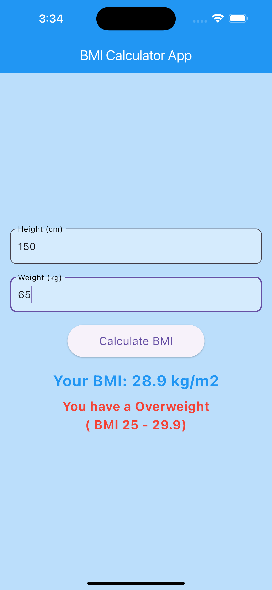
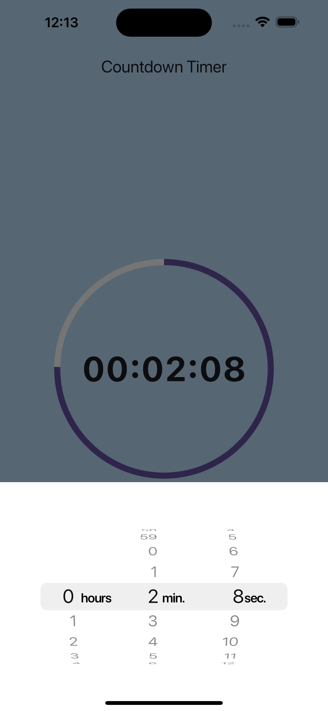
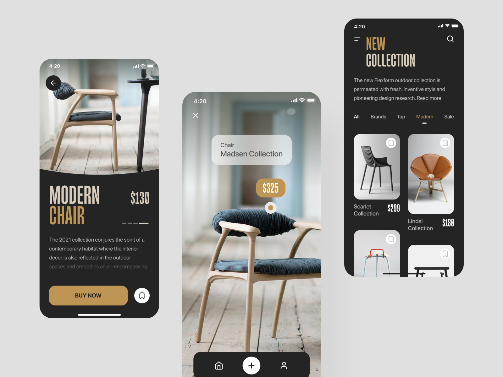
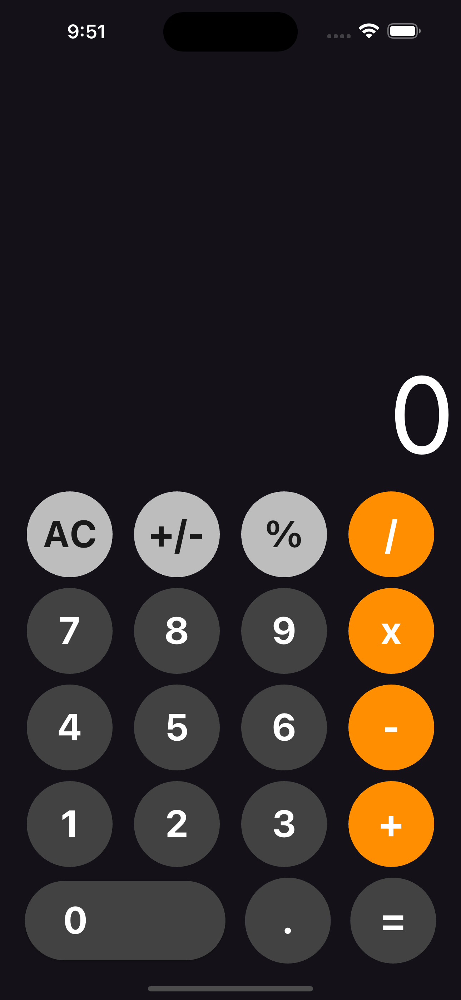

# Flutter
This repository contains the source code for various Flutter tutorials, including UI design, animations, hover effects for Flutter Web, simple apps, games, responsive design, and more. Some screenshots of the tutorial outputs are also attached. 

Check out the channel for more details: https://www.youtube.com/@wtf-code
 

## Screenshots

 

 
 

 
 
### Thanks for visiting.